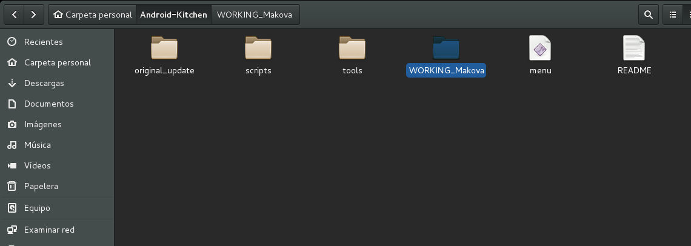

# Debian Wheezy i386

Guía de instalación [Instalación](https://www.debian.org/releases/stable/i386/) desde un CD [Debian Wheezy](http://cdimage.debian.org/debian-cd/7.8.0/i386/iso-cd/), se aconseja la arquitectura i386 para no tener problemas con las dependencias, después de actualizar cambiar los repositorios apuntando a la versión **testing** (*Jessie*). Esto lo podemos realizar desde el **sources.list** con el siguiente comando en una terminal:

`sudo nano /etc/apt/sources.list`

cambiando la parte del nombre **Wheezy** por el de **Jessie** o **testing**, en las siguientes líneas del archivo y aconsejable también añadir los **non-free** y **backports** como se ve en la siguiente captura:

O desde **Synaptic**:

He preferido utilizar Debian en la versión considerada como testing (Jessie) por disponer de paquetes y programas más actualizados que la rama stable (Wheezy), de esta manera nos aseguramos que las herramientas y programas para trabajar con emulación, cocina y Android studio será menos complicada.
También se podría haber utilizado Ubuntu 14.04 con un entorno más liviano como Gnome-classic o XFCE, pero Debian por algo es "papa" de Ubuntu y derivadas, teniendo mucha información y una gran comunidad detrás. El hecho de apuntar los repositorios de Debian Wheezy a la rama testing (Jessie) es como estar en la stable de Ubuntu 14.04, en lo que a actualizaciones se refiere.

# Java de Oracle

Yo siempre he instalado [Java de Oracle](http://www.oracle.com/technetwork/java/javase/downloads/index.html) desde la propia web, pero también se puede por repositorios de [Webupd8](http://www.webupd8.org/2012/01/install-oracle-java-jdk-7-in-ubuntu-via.html) o desde Synaptic los OpenJDK mantenidos por la comunidad.
Recomiendo la versión 7 de Java por no dar problemas en el desarrollo con Android. También especificar las siglas de Java, JDK y JRE:

>+ JDK > "Java Development Kit" (Kit de desarrollo Java) > Versión para los desarrolladores. Incluye el compilador de Java (javac), JRE y JVM.

>+ JRE > "Java Runtime Environment" (Entorno de ejecución Java) > Versión para los usuarios. Conjunto de utilidades de Java, que actúa como un "intermediario" entre el sistema operativo y Java. Incluye JVM.

>+ JVM > "Java Virtual Machine" (Máquina Virtual de Java) > Programa que ejecuta el código Java previamente compilado (bytecode) mientras que las librerías de clase estándar son las que implementan el API de Java. Ambas JVM y API deben ser consistentes entre sí, de ahí que sean distribuidas de modo conjunto.

## Instalación de JDK para desarrolladores

Una vez seleccionada la página de descarga de JDK, activamos la casilla para aceptar la licencia y seleccionamos el paquete para Linux ".tar.gz" de 32 bits "jdk-[version]-jdk-7u75-linux-i586.tar.gz
Una vez descargado en nuestra carpeta personal (no en la carpeta Descargas), lo descomprimimos con el comando:

`tar -xvf jdk-7u75-linux-i586.tar.gz`

Si no lo tenemos, creamos un directorio "/jvm/jdk1.7.0" en "/usr/lib", donde moveremos la carpeta descomprimida:

`sudo mkdir -p /usr/lib/jvm/jdk1.7.0`

Movemos la carpeta descomprimida al directorio creado:

`sudo mv jdk1.7.0_75/* /usr/lib/jvm/jdk1.7.0/`

Ejecutamos los siguientes comandos para java, javac (compilador) y javaws, respectivamente:

`sudo update-alternatives --install "/usr/bin/java" "java" "/usr/lib/jvm/jdk1.7.0/bin/java" 1`

`sudo update-alternatives --install "/usr/bin/javac" "javac" "/usr/lib/jvm/jdk1.7.0/bin/javac" 1`

`sudo update-alternatives --install "/usr/bin/javaws" "javaws" "/usr/lib/jvm/jdk1.7.0/bin/javaws" 1`

Si hemos instalado OpenJDK u otras versiones de Java (la 6), debemos decirle al sistema que utilice jdk1.7.0 de Oracle con el comando:

`sudo update-alternatives --config java`

Seleccionamos la opción que contenga "jdk1.7.0".

Fuente de instalacion Java: [Ubuntu-guia](http://www.ubuntu-guia.com/2012/04/instalar-oracle-java-7-en-ubuntu-1204.html)

# La cocina (Android-Kitchen)

Podemos descargar la cocina de [dsixda](https://github.com/dsixda/Android-Kitchen) portada por [Javilonas en GitHub](https://github.com/javilonas/Android-Kitchen).
Descargamos el .zip y lo descomprimimos, quedando una carpeta como Android-Kitchen como muestra el siguiente pantallazo:

Abrimos una terminal y damos permisos `sudo chmod +x menu` dentro de nuestra carpeta personal `cd` lanzamos la Kitchen para ver las opciones:

`./menu`

Apareciendo las siguientes opciones de cocinar una ROM Android:

Salimos con la letra `x`

Ahora desacrgamos una rom de [Sammobile](http://www.sammobile.com/firmwares/) del modelo que queramos cocinar, pongo de ejemplo Samsung ya que es con la marca de móvil que más he cocinado. En este caso he bajado la del Samsung Galaxy S5 G900F, versión de Android 5.0 Lollipop SDK21.
Con el siguiente número **BTU-G900FXXU1BOB7-20150223084756** ya que lo mejor es descargar una rom Libre que no pertenezca a ninguna compañía teléfonica, siendo del país que queramos. Lo que hacemos entre la comunidad es compartir las rom de Sammobile por la nube y de esta manera no tener que pasar por el tiempo de descarga (unas 5 horas dependiendo de la tarifa de cada uno).
Vamos a cocinar la ROM:

* Descomprimir el **.zip** para extraer el archivo **tar.md5** `G900FXXU1BOB7_G900FOXA1BOB7_G900FXXU1BOB7_HOME.tar.md5`renombrando a **.tar** sin el **.md5** del hash.
Ahora ya si lo copiamos en la carpeta original_update de la Kitchen como muestra el pantallazo:

* Abrimos la Kitchen desde una terminal y extraemos la ROM con la opción **1** y aceptamos:

Aceptamos y podemos ponerle un nombre o dejarlo todo por defecto, obteniendo el siguiente resultado:

Quedando las carpetas de la Kitchen así:

