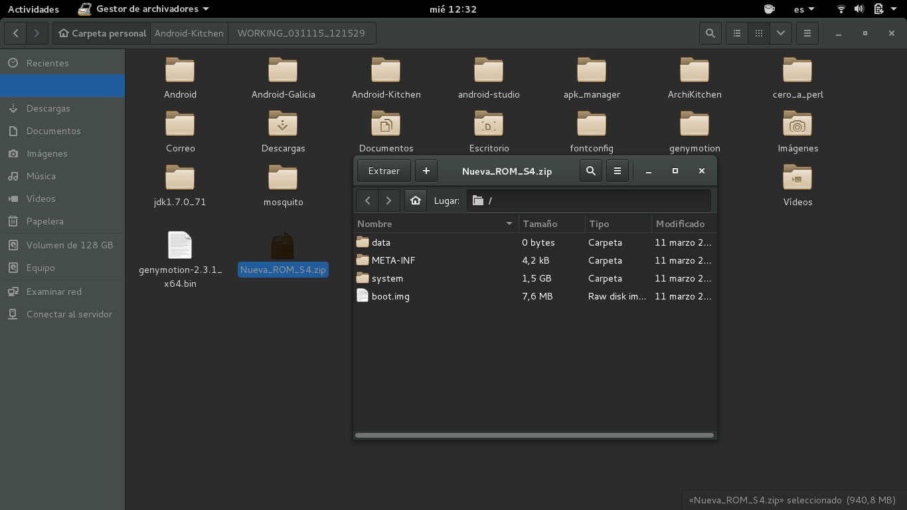

# Debian Wheezy i386

Guía de instalación [Instalación](https://www.debian.org/releases/stable/i386/) desde un CD [Debian Wheezy](http://cdimage.debian.org/debian-cd/7.8.0/i386/iso-cd/), se aconseja la arquitectura i386 para no tener problemas con las dependencias, después de actualizar cambiar los repositorios apuntando a la versión **testing** (*Jessie*). Esto lo podemos realizar desde el **sources.list** con el siguiente comando en una terminal:

`sudo nano /etc/apt/sources.list`

cambiando la parte del nombre **Wheezy** por el de **Jessie** o **testing**, en las siguientes líneas del archivo y aconsejable también añadir los **non-free** y **backports** como se ve en la siguiente captura:

O desde **Synaptic**:

He preferido utilizar Debian en la versión considerada como testing (Jessie) por disponer de paquetes y programas más actualizados que la rama stable (Wheezy), de esta manera nos aseguramos que las herramientas y programas para trabajar con emulación, cocina y Android studio será menos complicada.
También se podría haber utilizado Ubuntu 14.04 con un entorno más liviano como Gnome-classic o XFCE, pero Debian por algo es "papa" de Ubuntu y derivadas, teniendo mucha información y una gran comunidad detrás. El hecho de apuntar los repositorios de Debian Wheezy a la rama testing (Jessie) es como estar en la stable de Ubuntu 14.04, en lo que a actualizaciones se refiere.

# Java de Oracle

Yo siempre he instalado [Java de Oracle](http://www.oracle.com/technetwork/java/javase/downloads/index.html) desde la propia web, pero también se puede por repositorios de [Webupd8](http://www.webupd8.org/2012/01/install-oracle-java-jdk-7-in-ubuntu-via.html) o desde Synaptic los OpenJDK mantenidos por la comunidad.
Recomiendo la versión 7 de Java por no dar problemas en el desarrollo con Android. También especificar las siglas de Java, JDK y JRE:

>+ JDK > "Java Development Kit" (Kit de desarrollo Java) > Versión para los desarrolladores. Incluye el compilador de Java (javac), JRE y JVM.

>+ JRE > "Java Runtime Environment" (Entorno de ejecución Java) > Versión para los usuarios. Conjunto de utilidades de Java, que actúa como un "intermediario" entre el sistema operativo y Java. Incluye JVM.

>+ JVM > "Java Virtual Machine" (Máquina Virtual de Java) > Programa que ejecuta el código Java previamente compilado (bytecode) mientras que las librerías de clase estándar son las que implementan el API de Java. Ambas JVM y API deben ser consistentes entre sí, de ahí que sean distribuidas de modo conjunto.

## Instalación de JDK para desarrolladores

Una vez seleccionada la página de descarga de JDK, activamos la casilla para aceptar la licencia y seleccionamos el paquete para Linux ".tar.gz" de 32 bits "jdk-[version]-jdk-7u75-linux-i586.tar.gz
Una vez descargado en nuestra carpeta personal (no en la carpeta Descargas), lo descomprimimos con el comando:

`tar -xvf jdk-7u75-linux-i586.tar.gz`

Si no lo tenemos, creamos un directorio "/jvm/jdk1.7.0" en "/usr/lib", donde moveremos la carpeta descomprimida:

`sudo mkdir -p /usr/lib/jvm/jdk1.7.0`

Movemos la carpeta descomprimida al directorio creado:

`sudo mv jdk1.7.0_75/* /usr/lib/jvm/jdk1.7.0/`

Ejecutamos los siguientes comandos para java, javac (compilador) y javaws, respectivamente:

`sudo update-alternatives --install "/usr/bin/java" "java" "/usr/lib/jvm/jdk1.7.0/bin/java" 1`

`sudo update-alternatives --install "/usr/bin/javac" "javac" "/usr/lib/jvm/jdk1.7.0/bin/javac" 1`

`sudo update-alternatives --install "/usr/bin/javaws" "javaws" "/usr/lib/jvm/jdk1.7.0/bin/javaws" 1`

Si hemos instalado OpenJDK u otras versiones de Java (la 6), debemos decirle al sistema que utilice jdk1.7.0 de Oracle con el comando:

`sudo update-alternatives --config java`

Seleccionamos la opción que contenga "jdk1.7.0".

Fuente de instalacion Java: [Ubuntu-guia](http://www.ubuntu-guia.com/2012/04/instalar-oracle-java-7-en-ubuntu-1204.html)

# La cocina (Android-Kitchen)

Podemos descargar la cocina de [dsixda](https://github.com/dsixda/Android-Kitchen) portada por [Javilonas en GitHub](https://github.com/javilonas/Android-Kitchen).
Descargamos el .zip y lo descomprimimos, quedando una carpeta como Android-Kitchen como muestra el siguiente pantallazo:

Abrimos una terminal y damos permisos `sudo chmod +x menu` dentro de nuestra carpeta personal `cd` lanzamos la Kitchen para ver las opciones:

`./menu`

Apareciendo las siguientes opciones de cocinar una ROM Android:

Salimos con la letra `x`

Ahora desacrgamos unas rom de [Sammobile](http://www.sammobile.com/firmwares/) del modelo que queramos cocinar, pongo de ejemplo Samsung ya que es con la marca de móvil que más he cocinado. En este caso he bajado la del Samsung Galaxy S5 G900F y del Samsung S4 i9500, versiones de Android 5.0 Lollipop SDK21 y Android 4.2.2 SDK19 respectivamente.
Con los siguientes números **BTU-G900FXXU1BOB7-20150223084756.zip** **I9195UBUBNE2_I9195ZTOBNE2_ZTO.zip** ya que lo mejor es descargar una rom Libre que no pertenezca a ninguna compañía teléfonica, siendo del país que queramos. Lo que hacemos entre la comunidad es compartir las rom de Sammobile por la nube y de esta manera no tener que pasar por el tiempo de descarga (unas 5 horas dependiendo de la tarifa de cada uno).
Vamos a cocinar la ROM:

* Descomprimir el **.zip** para extraer el archivo **tar.md5** `G900FXXU1BOB7_G900FOXA1BOB7_G900FXXU1BOB7_HOME.tar.md5` `I9195UBUBNE2_I9195ZTOBNE2_I9195UBUBNE2_HOME.tar.md5`renombrandolos como **.tar** sin el **.md5** del hash.
Ahora ya si lo copiamos en la carpeta original_update de la Kitchen como muestra el pantallazo:

* Abrimos la Kitchen desde una terminal y extraemos la ROM con la opción **1** y aceptamos:

Quedando las carpetas de la Kitchen así:

Ojo, en el paso siguiente nos pide permisos para extraer archivos:

Aceptamos y podemos ponerle un nombre o dejarlo todo por defecto, obteniendo el siguiente resultado:

Podemos salir de la terminal y entar en la rom descompactada para comenzar a eliminar app que no vamos a utilizar, a este proceso se le denomina como "Litear" o hacer un "Liteo"

Dejaremos por ahora el [liteo](http://www.esp-desarrolladores.com/showthread.php?t=3066) que no todo se puede eliminar :-)

Seguimos.

> Aclarar que la cocina Android que estoy utilizando es para dispositivos Samsung. Para las [Rom Miui](http://miui.es/index.php?topic=181.0) se puede realizar de forma muy parecida y utilizando la misma [Kitchen](http://forum.xda-developers.com/showthread.php?t=633246).

> Hoy día las capas de personalización comienzan a no ser tan intrusivas y devoradoras de RAM y por tanto de los recursos de nuestros móviles, que dicho sea de paso, se venden con más memoria y mejores procesadores. 

> Pero las capas de personalización, en este caso Samsung, no han dejado ni dejan de ser un escollo a la hora de recibir actualizaciones al ritmo de las que realiza el propio Google con Android. Esto es debido a que las compañías tienen que trabajar sobre esa actualización y la capa que imponen en sus dispositivos, demorándose considerablemente en liberar dichas actualizaciones y que en el caso de algunos dispositivos hasta dejen de actualizarlos, como el S3, que fue uno de los modelos más vendidos por Samsung y al que relegaron a una versión definitiva de Android 4.3 por disponer de "solo" 1 GB de RAM.  > Motivo infundado e infumable, solo hay que ver los port y rom basadas en Android 4.4 y 5.0 funcionando perfectamente en ese modelo. Por este motivo el hecho de que en modelos anteriores de Samsung esas mismas capas de personalización eran un obstáculo a la hora de poder tener un SO Android "puro" para aprovechar todo el potencial del dispositivo elegido, o por lo menos que no se ralentizara y la batería se agotase sin terminar el día, a parte de no poder quitar o congelar la cantidad de app que no íbamos a utilizar nunca o nos eran innecesarias para un uso cotidiano y personalizado. A nivel personal creo que la cocina en Android nació para poder mejorar este añadido de personalización por compañías como Samsung, una de las que más dispositivos con Android ha vendido a lo largo de estos años, sin menospreciar a otras marcas como LG, HTC, Sony, etc...

## Las opciones de la Kitchen:

* **1** Crea el espacio de trabajo y desempaqueta la ROM.

* **2**  Rootea

* **3**  Añade BusyBox. No es más que un conjunto de herramientas habituales en UNIX y que no están en Android

* **4**  Elimina el sonido al encender el móvil

* **5**  Alinea todos los paquetes .apk para optimizar el uso de la RAM. Esta opción no la utilizaremos porque lo haremos al construir la ROM

* **6**  Establece si la ROM realizará los wipes, es mejor que esa operación la hagan los usuarios para no borrar datos sin necesidad

* **7**  Cambiar el nombre de compilación. También se puede editar el archivo [build.prop](http://www.htcmania.com/showthread.php?t=549296)

* **8**  Muestra toda la información de la ROM, nos será de utilidad para saber qué hemos hecho y qué queda

### **0** *Advanced Options*

* **11**  “Deodexa” los paquetes. Las ROMs oficiales incorporan los paquetes divididos en un archivo [.apk](http://es.wikipedia.org/wiki/APK_%28formato%29) y otro [.odex](http://www.digitalika.com/2013/03/cual-es-la-diferencia-entre-odex-y-deodex-en-android/). Con esto se acelera el arranque del dispositivo la primera vez que se inicia. Sin embargo, cuando lo que se pretende es modificarlos, es un problema porque no podemos acceder al contenido por estar dividido. Esta opción los vuelve a unificar. La parte negativa es que la primera vez que se inicie la ROM tardará un poco, el resto de veces iniciará rápido

* **12**  Desempaqueta/empaqueta el kernel, esta opción es mejor no tocarla si no sabemos qué estamos haciendo

* **13**  Añade el soporte para el directorio /data/app. Las aplicaciones que integremos en la carpeta /system/app no pueden estar firmadas, por este motivo, si queremos añadir más aplicaciones lo habitual es que estén firmadas, así que no funcionarán. La solución es añadir este directorio y meter aquí dichas apps

* **14**  Esta opción añade soporte para el directorio /etc/init.d, su utilizad es ejecutar todos los scripts que se encuentren en él en cada inicio del móvil

* **15**  Desempaqueta el archivo data.img

* **16**  Firma un apk o un .zip

* **17**  Convierte el script de instalación del formato update-script a updater-script. Se hace automáticamente al construir la ROM, así que no es necesario que lo hagamos

* **18**  Plugins de la cocina

Fuente opciones Kitchen: [joshelu.es](http://www.joshelu.es/2013/05/07/como-cocinar-nuestra-propia-rom-para-android-la-cocina/#sthash.xk8PKVIP.dpbs)

Algunos pantallazos de la cocina en acción, deodexando, haciendo root, etc. Al final se comprime todo en un archivo .zip que será el que se utiliza para flashear la ROM ya cocinada por el [Recovery](https://getmovil.com/android/instalar-cwm-twrp-recovery/) que tengamos en nuestro dispositivo:

# APK-Manager

### Trabajando en las **.apk** de Android

* Descargamos la última versión de apk-manager para Linux desde [apkmultitool](http://apkmultitool.com/?q=node/5) la versión 5.0
*  Descomprimimos el archivo **.zip** en la carpeta personal, mejor en nuestra **/Home** quedando la carpeta **apk_manager_linux_5.0**
* Entramos en ella desde una terminal con `cd apk_manager_linux_5.0` y damos permisos con chmod `sudo chmod 755 Script.sh` y dentro 
de la carpeta **other** `cd other` al resto de archivos `sudo chmod 755 7za apktool.jar apktool optipng testkey.pk8 testkey.x509.pem signapk.jar aapt`
* Lanzamos el apk-manager con el siguiente comando `./Scrip.sh` si queremos podemos renombrar `Script.sh` por `script.sh` funciona igual.

* El **.apk** que queramos modificar debemos de extraerlo de la ROM en la ruta **/system/app** en el archivo de trabajo que creamos en la Kitchen

* Copiar el **.apk** a modificar en la carpeta **"place-apk-here-for-modding"**.

